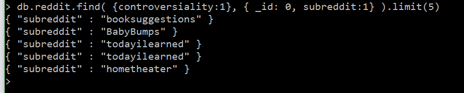
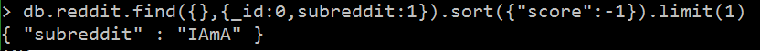
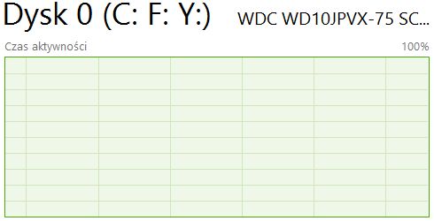
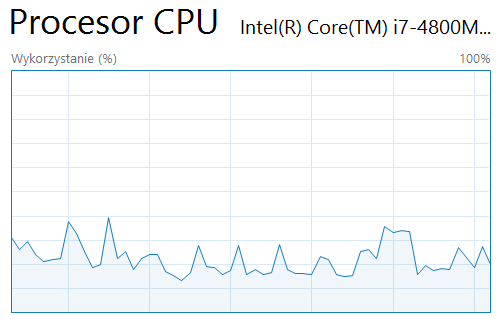
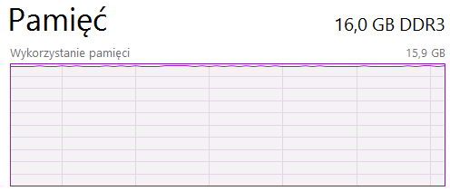
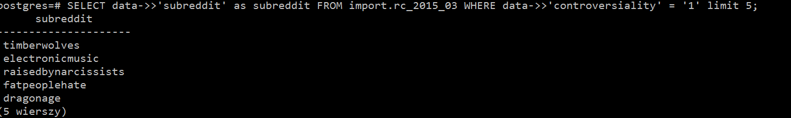
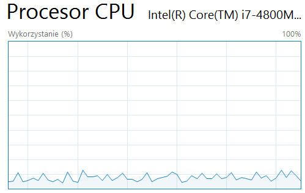
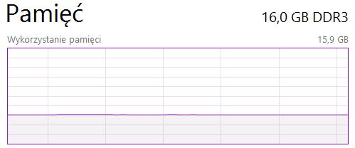
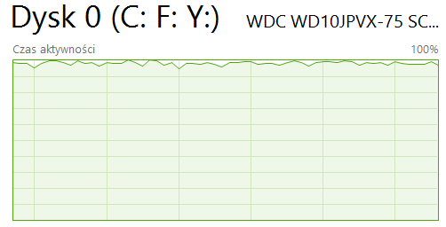
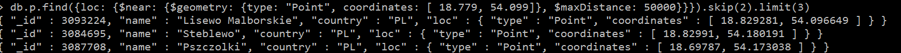

# nosql
Specyfikacja komputera

System: Windows 10 64bit

procesor: i7 4800MQ 2.70ghz

RAM: 16GB

Dysk: wd10jpvx-75 scsi, Cache: 8mb, Rotation Speed: 5400 RPM, Model: Blue

#Mongo

Na pocztek zainstalowalem mongo. Pobralem program bunzip2 i baze reddit.
Uruchomilem mongod poleceniem: mongod --storageEngine wiredTiger --dbpath f:\mongo\bin\tygrys
Nasstepnie zaimportowalem baze poleceniem: bunzip2 -c RC_2015-03.bz2 | mongoimport --drop --host 127.0.0.1 -d baza -c reddit

czas importu 53:43:2

Na koniec uruchomilem mongo: mongo baza

#zliczenie rekordow
db.reddit.count()

54564441

czas: natychmiast

#zliczenie wszystkich autorów zaczynajacych sie na litere m

komenda: db.reddit.find({author: /^m/}).count()

1700219

czas 14.5min

#piec pierwszych kontrowersyjnych tematow

db.reddit.find({controversality:1}, {_id:0, subreddit:1}).limit(5)

czas 7.3 min

#najlepiej oceniany temat

db.reddit.find({},{_id:0, subreddit:1}).sort({"score":-1})limit(1)

czas 17.8min

#Zachowanie podzespolow

Procesor nie ma dużego wplywu na czas operacji. Obciazenie procesora nie przekraczalo 30%, jednak pamiec ram i dysk byly wykorzystywane w 100%.

#Postgres

Zainstalowalem Postgres. Rozpakowalem baze za pomoca bunzip2. Pobralem program pgfutter i dzieki niemu zaimportowalem jsona do sql nastepujaca komenda

pgfutter --db postgres --user postgres --pw marek json RC_2015_03

czas importu 1h 44min

#zliczenie rekordow

komenda: select count(*) from import.rc_2015_03;

54564441

czas 21 min

#zliczenie wszystkich autorów zaczynajacych sie na litere m

komenda: SELECT count(*) FROM import.rc_2015_03 WHERE data->>'author' like ('m%');

1700219

czas: 28.3min

#piec pierwszych kontrowersyjnych tematow

komenda: SELECT data->>'subreddit' as subreddit FROM import.rc_2015_03 WHERE data->>'controversiality' = '1' limit 5;

czas: 9.7min

#wartosc najlepiej ocenianego tematu

komenda: SELECT MAX(data->>'score') FROM import.rc_2015_03;

czas 12.1 min

#Zachowanie podzespolow

Postgres jest wolniejszy od Mongo, ale absorbuje mniej ram i procesora.

# GeoJson

Zaimmportowaem jsona, który zawieral  miasta Polski poleceniem ####mongoimport -d p -c p < pl.json .

Dodalem GeoIndex:

db.p.ensureIndex({"loc": "2dsphere"})
{
  "createdCollectionAutomatically": false,
  "numIndexesBefore": 1,
  "numIndexesAfter": 2,
  "ok": 1
}

Wyszukalem 3 najblizsze miejscowosci od Tczewa.

[mapa](https://github.com/Marek4f/nosql/blob/master/1.geojson)
