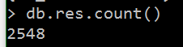
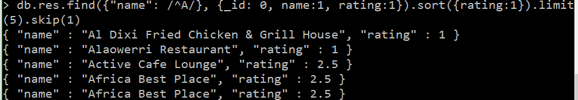
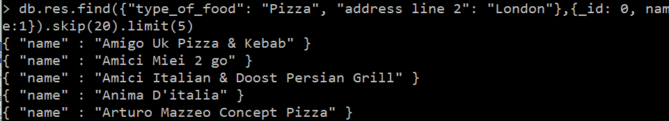
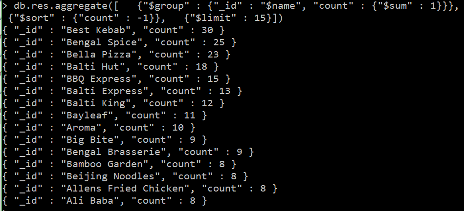
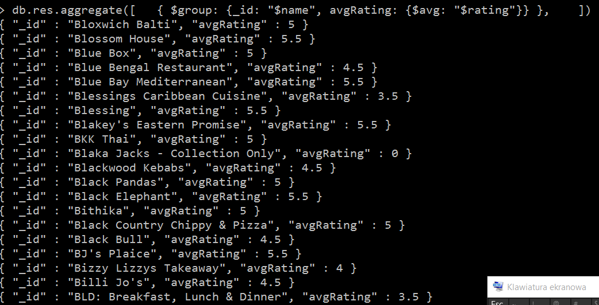
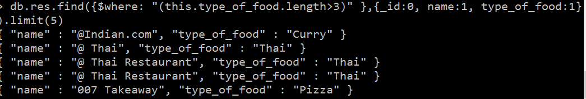
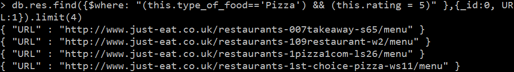
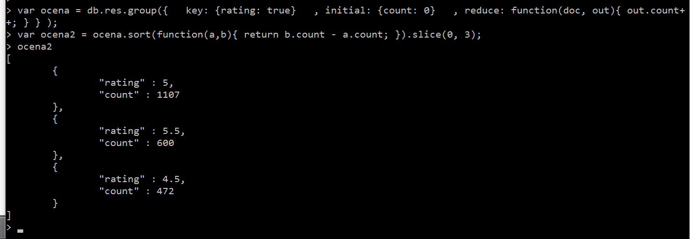
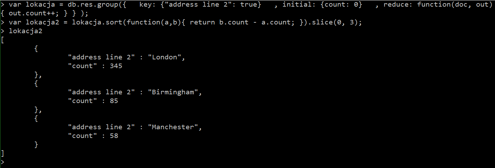

#Marek Eggert

Zaimportowalem baze restauracji poleceniem 
mongoimport --db bazka --collection res --drop --file res.json
Zostala zaimportowana natychmiast. Poleceniem
db.res.count()
zliczylem wszystkie rekordy.

#sortowanie

Wyswietlenie 5 restauracji zaczynajacych sie na "A" wyswietlajac od najgorszej oceny

Wyswietlenie 5 restauracji serwujacych pizze w Londynie

#agregacje

Wyswietlenie 15 najczesciej powtarzajacych sie nazw restauracji

wyswietlenie srednich ocen dla restauracji

#Javascript

Wyswietlenie restauracji majacych dlugosc nazwy serwowanego jedzenia dluzsza niz 3 znaki

Wyswietlenie adresow url restauracji serwujacych pizze i majace maksymalna ocene

Wyswietlenie 3 najczesciej dawanych ocen za pomoca grupowania

Wyswietlenie 3 najczestrzych lokacji

