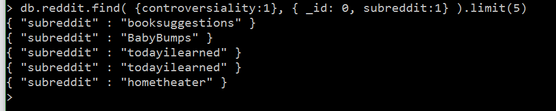
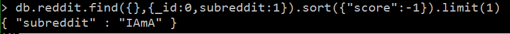
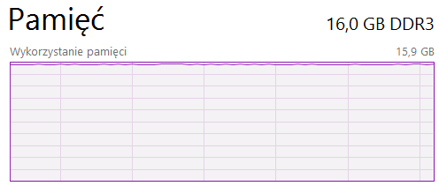

# nosql
Specyfikacja komputera

System: Windows 10 64bit

procesor: i7 4800MQ 2.70ghz

RAM: 16GB

Dysk: wd10jpvx-75 scsi, Cache: 8mb, Rotation Speed: 5400 RPM, Model: Blue

#Mongo

Na pocztek zainstalowalem mongo. Pobralem program bunzip2 i baze reddit.
Uruchomilem mongod poleceniem: mongod --storageEngine wiredTiger --dbpath f:\mongo\bin\tygrys
Nasstepnie zaimportowalem baze poleceniem: bunzip2 -c RC_2015-03.bz2 | mongoimport --drop --host 127.0.0.1 -d baza -c reddit

czas importu 53:43:2

Na koniec uruchomilem mongo: mongo baza


#zliczenie rekordow
db.reddit.count()

54564441


#zliczenie wszystkich autorów zaczynajacych sie na litere m

komenda: db.reddit.find({author: /^m/}).count()

1700219

#piec pierwszych kontrowersyjnych tematow

db.reddit.find({controversality:1}, {_id:0, subreddit:1}).limit(5)


#najlepiej oceniany temat

db.reddit.find({},{_id:0, subreddit:1}).sort({"score":-1})limit(1)



#Postgres

Zainstalowalem Postgres. Rozpakowalem baze za pomoca bunzip2. Pobralem program pgfutter i dzieki niemu zaimportowalem jsona do sql nastepujaca komenda

pgfutter --db postgres --user postgres --pw marek json RC_2015_03

czas importu 1h 44min

#zliczenie rekordow

komenda: select count(*) from import.rc_2015_03;

54564441

#zliczenie wszystkich autorów zaczynajacych sie na litere m

komenda: SELECT count(*) FROM import.rc_2015_03 WHERE data->>'author' like ('m%');

1700219

#piec pierwszych kontrowersyjnych tematow

komenda: SELECT data->>'subreddit' as subreddit FROM import.rc_2015_03 WHERE data->>'controversiality' = '1' limit 5;


#wartosc najlepiej ocenianego tematu

komenda: SELECT MAX(data->>'score') FROM import.rc_2015_03;

# wnioski

| mongo | postgres| zadanie|
|-------|---------|-------|
| natychmiast    |  21 min | zliczenie rekordow|
|    14.5min   |  28.3min  |  zliczenie wszystkich autorów zaczynajacych sie na litere m      |
|       7.3 min  |    9.7min         |      piec pierwszych kontrowersyjnych tematow      |
|    10.8min         |      12.1      |  wartosc najlepiej ocenianego tematu      |

Zachowanie podzespolow

# mongo



# postgres


Mongo jest szybsze od postgres, jednak na Windows podczas dluzszego wyszukiwania zabiera 100% ramu. Z Postgres tego problemu nie ma. Udzial procesora nie gra duzej roli. Podstawa to dysk i w przypadku Mongo pamiec RAM. Przy pierwszych podejsciach przeszkadza w Mongo nieintuicyjna konstrukcja polecen, jednak po czasie okazuja sie byc prostsze od postgres. Mongo lepiej radzi sobie z duzymi bazami danych. Jest szybsze.

# GeoJson

Zaimmportowaem jsona, który zawieral  miasta Polski poleceniem ####mongoimport -d p -c p < pl.json .


Dodalem GeoIndex:

db.p.ensureIndex({"loc": "2dsphere"})
{
  "createdCollectionAutomatically": false,
  "numIndexesBefore": 1,
  "numIndexesAfter": 2,
  "ok": 1
}

Wyszukalem 3 najblizsze miejscowosci od Tczewa.


[mapa](https://github.com/Marek4f/nosql/blob/master/1.geojson)

# Poligon

te same miejscowoci + Tczew

db.p.find({ loc: {$geoWithin : { $geometry: { type : "Polygon", coordinates: [ [ [ 18.829281, 54.096649 ], [ 18.82991, 54.180191 ], [ 18.69787, 54.173038 ], [ 18.77787, 54.092419 ] ] ] } } }},{_id:0, name:1} )

```
{ "name": "Kozliny" }
{ "name": "Tczewskie Laki" }
{ "name": "Czatkowy" }
```

[mapa](https://github.com/Marek4f/nosql/blob/master/3.geojson)
# Line String

Wyswietlenie lini Tczew-Pszczolki


[mapa](https://github.com/Marek4f/nosql/blob/master/4.geojson)
